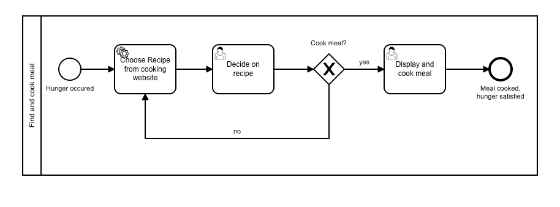

## Java Cloud: Recipe Worker 
The video tutorial for this repository can be found here: 
https://youtu.be/5z0AO2CM9Cs

This folder holds all the code for the Java Spring Boot version of the Camunda Cloud Worker. As client implementation we have used the spring-zeebe dependency. You can find the GitHub repository right [here](https://github.com/camunda-community-hub/spring-zeebe).

This Worker is processing the service task in the process diagram below:


To get a random recipe we have chosen to use the Spoonacular API. Therefore, this rest endpoint is called: 
```shell
 https://api.spoonacular.com/recipes/random?number=1
```
This project also contains a small self written Http Client to perform this exercise. 
For this example we make only use of some properties from the very complex Spoonacular response. During completion of this task we do set the properties *recipe_title* and *recipe_content*. 

In case you want to add this into your project as well just use this dependency in your pom file:
```shell
<dependency>
  <groupId>io.camunda</groupId>
  <artifactId>spring-zeebe-starter</artifactId>
  <version>${CURRENT_VERSION}</version>
</dependency>
```
